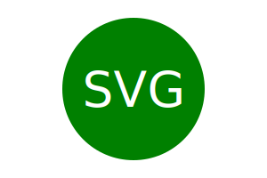

# OOP Challenge: SVG Logo Maker 

## Description
This challenge requires the development of a command-line application that generates a simple logo for projects. When the user is prompted for text, the user can enter up to three characters for the logo. When the user is prompted for text color, a color keyword (or hexadecimal number) can be entered. When the user is prompted for a logo shape, the user is presented with a list of shapes to choose from: circle, triangle, and square. When the user is prompted for the color of the shape, a color keyword (or hexadecimal number) can be entered by the user. Once the information is entered for the complete logo, an SVG file is created that is named 'logo.svg'. The output text "Generated logo.svg" is printed in the command line to let the user know that the logo has been generated. The user can then open the 'logo.svg' file in a browser, and the logo is displayed as a 300x200 pixel image that matches the criteria that the user was prompted to enter.

An example of an SVG image is shown here.

C:\Users\sctwo\Desktop\UNCC Bootcamp Information\workspace\10-OOP\02-Challenge\crispy-couscous\Challenge 10 - OOP SVG DEMO.webm

## Installation

The SVG Logo Maker is a command-line application.

## Usage

The information for the SVG Logo Maker can be found in the respository.

## Credits

N/A

## License

Please refer to the LICENSE in the repo.
